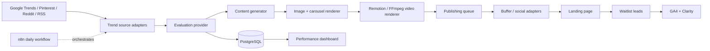

# Vinted Signal · Demand validation OS

An MVP content-marketing pipeline for validating demand for a Vinted trend intelligence SaaS before launch. The dashboard is usable without credentials: it ships with fixture data, a working waitlist interaction, and provider seams ready for live APIs.

## Included

- Responsive React dashboard and landing-page waitlist experience.
- Trend radar with source filtering and AI-style scoring fields.
- Content studio preview for multi-channel campaign generation.
- Publishing queue and waitlist analytics views.
- PostgreSQL schema for trends, campaigns, queue items, leads, and job runs.
- Importable n8n workflow at `automation/vinted-signal-daily.json`.
- Docker Compose for the web app, PostgreSQL, and n8n.
- Example structured campaign at `examples/campaign.json`.
- A runnable Node API in `server/` that discovers Google News RSS signals, evaluates them with OpenAI when configured, generates all channel copy, and stores campaigns locally.

## Run locally

```bash
npm ci
npm run dev
```

Open http://localhost:5173. The waitlist form stores a demo signup in `localStorage`; connect it to `POST /api/waitlist` when the API is deployed.

To run the real campaign API locally:

```bash
cp .env.example .env
# Set PRODUCT_* to the app you are marketing and add OPENAI_API_KEY for live AI copy.
npm run build
npm start
```

Then trigger a campaign:

```bash
curl -X POST http://localhost:3000/api/campaigns/run \
  -H "Content-Type: application/json" \
  -d '{"product":{"name":"Your app","url":"https://your-app.example","description":"What it does","audience":["your customers"],"callToAction":"Join the waitlist.","country":"PL"}}'
```

When `SUPABASE_URL` and the server-only `SUPABASE_SERVICE_ROLE_KEY` are set, campaigns, waitlist leads, and funnel events are stored in Supabase; otherwise they are saved under `.data/` for the local MVP. Without `OPENAI_API_KEY`, the pipeline still runs with deterministic fallback scoring and copy so the workflow can be tested end to end; set the key to generate production-quality copy.

Campaigns include channel-specific UTM links under `content.tracking.links`. The public landing page records `page_view` events and sends the same UTM attribution with waitlist signups, allowing conversion by campaign and channel to be measured without a paid analytics service. Apply `database/migrations/20260725_add_funnel_attribution.sql` to an existing Supabase project before deploying this version.

For a live deployment, apply [`database/schema.sql`](./database/schema.sql) to the Supabase SQL editor, then configure `SUPABASE_URL` and `SUPABASE_SERVICE_ROLE_KEY` in the server environment. The service-role key must remain server-side; the API health response reports `storage: "supabase"` when the connection is configured.

### Vercel deployment

Vercel serves the Vite frontend and explicit serverless functions under `api/` together. Configure these project environment variables in Vercel for **Production** and **Preview** as appropriate:

```env
OPENAI_API_KEY=
OPENAI_MODEL=gpt-5-mini
SCRAPPA_API_KEY=
SUPABASE_URL=https://<project-ref>.supabase.co
SUPABASE_SERVICE_ROLE_KEY=
ADMIN_API_TOKEN=
ALLOWED_ORIGIN=https://<your-project>.vercel.app
PRODUCT_NAME=
PRODUCT_URL=
PRODUCT_DESCRIPTION=
PRODUCT_AUDIENCE=
PRODUCT_LANGUAGE=pl
PRODUCT_CTA=
PRODUCT_COUNTRY=PL
PRODUCT_SEARCH_QUERY=
```

`PRODUCT_LANGUAGE` controls the language of AI reasoning and generated campaign copy. Set it to `en` for English campaigns; for a Polish Vinted-seller audience, `pl` is the recommended validation default. Google News discovery is deduplicated by normalized topic before scoring, so one repeated article cannot create multiple campaigns in a single run.

`SCRAPPA_API_KEY` enables live Vinted marketplace discovery through Scrappa. The provider returns active listing counts, asking-price medians, and favourites as a demand proxy; it does not prove completed sales. Use repeated snapshots before treating listing disappearance as a sales-velocity estimate.

The campaign workflow now stores one `marketplace_snapshots` record per query and country on every live run. The next observation compares listing count, median price, average favourites, and disappeared listing IDs with the previous snapshot. `estimatedVelocity` is intentionally a proxy with low confidence; it is not confirmed sales data.

The dashboard uses a Supabase Auth user rather than a browser token. In the Supabase project, open **Authentication → Users → Add user**, create the operator email/password, then set `ADMIN_EMAIL` in Vercel Production to the same email. Content Studio exchanges the email/password for a server-side HttpOnly session cookie; the Supabase service-role key remains server-only. Direct automation callers may still use `Authorization: Bearer <ADMIN_API_TOKEN>`, but it is not needed for normal dashboard use.

## Run with Docker

```bash
cp .env.example .env
docker compose up --build
```

- Web: http://localhost:5173
- n8n: http://localhost:5678
- PostgreSQL: localhost:5432

Import the JSON workflow in n8n. It is inactive by default so production operators explicitly enable it. The workflow now calls `POST /api/campaigns/run` and sends the configured product profile through the complete discovery → evaluation → generation path. Social publishing is intentionally a separate adapter: connect Buffer or native social APIs after reviewing the generated campaign.

### Publishing integration status

The application can publish directly through Buffer Free when `BUFFER_ACCESS_TOKEN` and channel IDs are configured. It uses Buffer's GraphQL `createPost` mutation with `customScheduled` and only marks a queue item published after Buffer returns a post ID. The older `PUBLISH_WEBHOOK_URL` path remains available for n8n/native adapters.

The operator dashboard is the control plane for the full workflow: run discovery, inspect scored campaigns, process due queue items, publish an individual item immediately, retry failed items, cancel stale jobs, and export queue or waitlist CSVs. Buffer channel mapping limits new queue items to configured channels. Instagram assets are generated and uploaded to the public Supabase `campaign-assets` bucket on first publish; `BUFFER_DEFAULT_IMAGE_URL` or `content.imageUrl` can override the generated branded fallback.

```json
{
  "platform": "instagram",
  "scheduledFor": "2026-07-25T20:00:00.000Z",
  "campaign": { "id": "...", "content": {}, "product": {}, "trend": {} }
}
```

Without either Buffer or the webhook configuration, the dashboard keeps queue items un-published and reports that no provider is configured; it never claims a post was sent.

For Buffer:

1. Create a Personal Key in Buffer **Settings → API** with post-write permission.
2. Set `BUFFER_ACCESS_TOKEN` in Vercel Production.
3. Set `BUFFER_CHANNEL_IDS` to a JSON object mapping queue platforms to Buffer channel IDs, for example `{"linkedin":"...","instagram":"..."}`.
4. Run the queue action; each platform is scheduled using its existing `scheduledFor` timestamp.

The Buffer token is server-only and must never be stored in Supabase or committed to the repository.

The repository includes `automation/vinted-publisher-dispatcher.json` for the n8n side:

1. Import and activate the workflow in n8n.
2. Set `PUBLISH_LINKEDIN_URL`, `PUBLISH_INSTAGRAM_URL`, `PUBLISH_TIKTOK_URL`, `PUBLISH_YOUTUBE_URL`, and `PUBLISH_PINTEREST_URL` in n8n to secured Buffer/native-adapter endpoints.
3. Set Vercel `PUBLISH_WEBHOOK_URL` to the n8n production webhook URL ending in `/webhook/vinted-publisher`.
4. Use the dashboard queue action; the app sends the asset to n8n, n8n selects the platform adapter, and a successful 2xx response marks the queue item as published.

This dispatcher is the connector layer. It does not contain social credentials and it does not fake platform publishing; each channel URL must be backed by a real Buffer/native API node or workflow.

## Architecture



## Provider contracts

Keep each external dependency behind a small adapter. `src/lib/pipeline.ts` includes runnable mock implementations.

```ts
interface TrendSource {
  discover(country: string): Promise<TrendSignal[]>
}

interface TrendEvaluator {
  evaluate(signal: TrendSignal): Promise<Evaluation>
}

interface ContentGenerator {
  generate(signal: TrendSignal, evaluation: Evaluation): Promise<Campaign>
}
```

Recommended production swaps:

1. Replace fixture discovery with RSS feeds and Google Trends through server-side adapters.
2. Implement an OpenAI generator using `OPENAI_API_KEY` while preserving `examples/campaign.json`.
3. Render carousel HTML with Playwright, then use Remotion or FFmpeg to compose vertical MP4s.
4. Add Buffer or native social API credentials only after the waitlist funnel proves demand.

## Environment and quality

Copy `.env.example`; keep secrets out of git. Paid or restricted sources are adapter seams so the MVP remains runnable without them.

```bash
npm run lint
npm run type-check
npm run build
```
