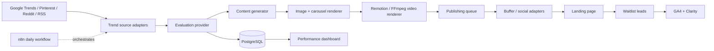

# Vinted Signal · Demand validation OS

An MVP content-marketing pipeline for validating demand for a Vinted trend intelligence SaaS before launch. The dashboard is usable without credentials: it ships with fixture data, a working waitlist interaction, and provider seams ready for live APIs.

## Included

- Responsive React dashboard and landing-page waitlist experience.
- Trend radar with source filtering and AI-style scoring fields.
- Content studio preview for multi-channel campaign generation.
- Publishing queue and waitlist analytics views.
- PostgreSQL schema for trends, campaigns, queue items, leads, and job runs.
- Importable n8n workflow at `automation/vinted-signal-daily.json`.
- Docker Compose for the web app, PostgreSQL, and n8n.
- Example structured campaign at `examples/campaign.json`.
- A runnable Node API in `server/` that discovers Google News RSS signals, evaluates them with OpenAI when configured, generates all channel copy, and stores campaigns locally.

## Run locally

```bash
npm ci
npm run dev
```

Open http://localhost:5173. The waitlist form stores a demo signup in `localStorage`; connect it to `POST /api/waitlist` when the API is deployed.

To run the real campaign API locally:

```bash
cp .env.example .env
# Set PRODUCT_* to the app you are marketing and add OPENAI_API_KEY for live AI copy.
npm run build
npm start
```

Then trigger a campaign:

```bash
curl -X POST http://localhost:3000/api/campaigns/run \
  -H "Content-Type: application/json" \
  -d '{"product":{"name":"Your app","url":"https://your-app.example","description":"What it does","audience":["your customers"],"callToAction":"Join the waitlist.","country":"PL"}}'
```

When `SUPABASE_URL` and the server-only `SUPABASE_SERVICE_ROLE_KEY` are set, campaigns and waitlist leads are stored in Supabase; otherwise they are saved under `.data/` for the local MVP. Without `OPENAI_API_KEY`, the pipeline still runs with deterministic fallback scoring and copy so the workflow can be tested end to end; set the key to generate production-quality copy.

For a live deployment, apply [`database/schema.sql`](./database/schema.sql) to the Supabase SQL editor, then configure `SUPABASE_URL` and `SUPABASE_SERVICE_ROLE_KEY` in the server environment. The service-role key must remain server-side; the API health response reports `storage: "supabase"` when the connection is configured.

### Vercel deployment

Vercel serves the Vite frontend and the `api/[[...path]].ts` serverless function together. Configure these project environment variables in Vercel for **Production** and **Preview** as appropriate:

```env
OPENAI_API_KEY=
OPENAI_MODEL=gpt-5-mini
SUPABASE_URL=https://<project-ref>.supabase.co
SUPABASE_SERVICE_ROLE_KEY=
ADMIN_API_TOKEN=
ALLOWED_ORIGIN=https://<your-project>.vercel.app
PRODUCT_NAME=
PRODUCT_URL=
PRODUCT_DESCRIPTION=
PRODUCT_AUDIENCE=
PRODUCT_CTA=
PRODUCT_COUNTRY=PL
PRODUCT_SEARCH_QUERY=
```

Generate `ADMIN_API_TOKEN` with `openssl rand -hex 32`. Keep it out of `VITE_*` variables and source code. `/api/health` and `/api/waitlist` are public; campaign discovery, execution, and stored-campaign reads require `Authorization: Bearer <ADMIN_API_TOKEN>`. Supabase tables have RLS enabled and are accessed only by the server-side service-role key.

## Run with Docker

```bash
cp .env.example .env
docker compose up --build
```

- Web: http://localhost:5173
- n8n: http://localhost:5678
- PostgreSQL: localhost:5432

Import the JSON workflow in n8n. It is inactive by default so production operators explicitly enable it. The workflow now calls `POST /api/campaigns/run` and sends the configured product profile through the complete discovery → evaluation → generation path. Social publishing is intentionally a separate adapter: connect Buffer or native social APIs after reviewing the generated campaign.

## Architecture



## Provider contracts

Keep each external dependency behind a small adapter. `src/lib/pipeline.ts` includes runnable mock implementations.

```ts
interface TrendSource {
  discover(country: string): Promise<TrendSignal[]>
}

interface TrendEvaluator {
  evaluate(signal: TrendSignal): Promise<Evaluation>
}

interface ContentGenerator {
  generate(signal: TrendSignal, evaluation: Evaluation): Promise<Campaign>
}
```

Recommended production swaps:

1. Replace fixture discovery with RSS feeds and Google Trends through server-side adapters.
2. Implement an OpenAI generator using `OPENAI_API_KEY` while preserving `examples/campaign.json`.
3. Render carousel HTML with Playwright, then use Remotion or FFmpeg to compose vertical MP4s.
4. Add Buffer or native social API credentials only after the waitlist funnel proves demand.

## Environment and quality

Copy `.env.example`; keep secrets out of git. Paid or restricted sources are adapter seams so the MVP remains runnable without them.

```bash
npm run lint
npm run type-check
npm run build
```
