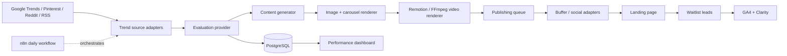

# Vinted Signal · Demand validation OS

An MVP content-marketing pipeline for validating demand for a Vinted trend intelligence SaaS before launch. The dashboard is usable without credentials: it ships with fixture data, a working waitlist interaction, and provider seams ready for live APIs.

## Included

- Responsive React dashboard and landing-page waitlist experience.
- Trend radar with source filtering and AI-style scoring fields.
- Content studio preview for multi-channel campaign generation.
- Publishing queue and waitlist analytics views.
- PostgreSQL schema for trends, campaigns, queue items, leads, and job runs.
- Importable n8n workflow at `automation/vinted-signal-daily.json`.
- Docker Compose for the web app, PostgreSQL, and n8n.
- Example structured campaign at `examples/campaign.json`.

## Run locally

```bash
npm ci
npm run dev
```

Open http://localhost:5173. The waitlist form stores a demo signup in `localStorage`; connect it to `POST /api/waitlist` when the API is deployed.

## Run with Docker

```bash
cp .env.example .env
docker compose up --build
```

- Web: http://localhost:5173
- n8n: http://localhost:5678
- PostgreSQL: localhost:5432

Import the JSON workflow in n8n. It is inactive by default so production operators explicitly enable it.

## Architecture



## Provider contracts

Keep each external dependency behind a small adapter. `src/lib/pipeline.ts` includes runnable mock implementations.

```ts
interface TrendSource {
  discover(country: string): Promise<TrendSignal[]>
}

interface TrendEvaluator {
  evaluate(signal: TrendSignal): Promise<Evaluation>
}

interface ContentGenerator {
  generate(signal: TrendSignal, evaluation: Evaluation): Promise<Campaign>
}
```

Recommended production swaps:

1. Replace fixture discovery with RSS feeds and Google Trends through server-side adapters.
2. Implement an OpenAI generator using `OPENAI_API_KEY` while preserving `examples/campaign.json`.
3. Render carousel HTML with Playwright, then use Remotion or FFmpeg to compose vertical MP4s.
4. Add Buffer or native social API credentials only after the waitlist funnel proves demand.

## Environment and quality

Copy `.env.example`; keep secrets out of git. Paid or restricted sources are adapter seams so the MVP remains runnable without them.

```bash
npm run lint
npm run type-check
npm run build
```
